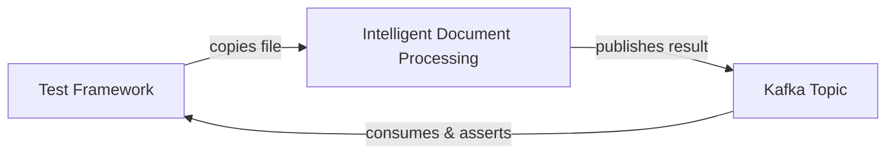
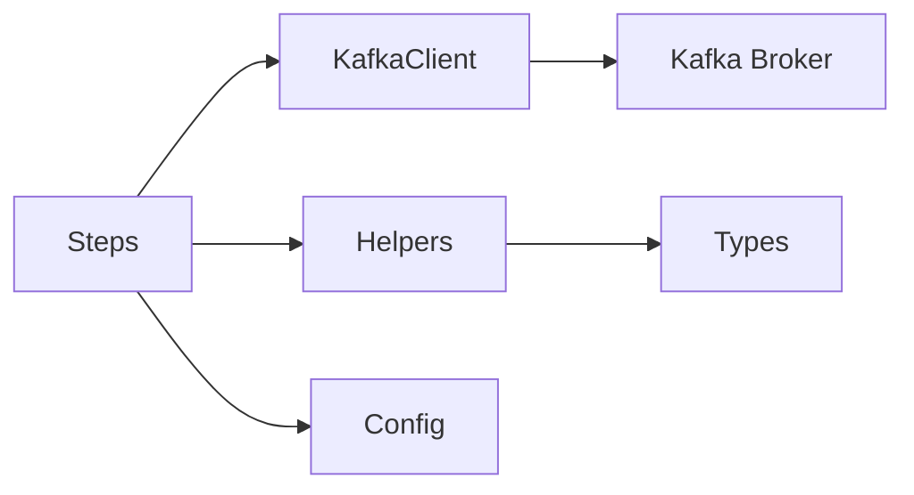
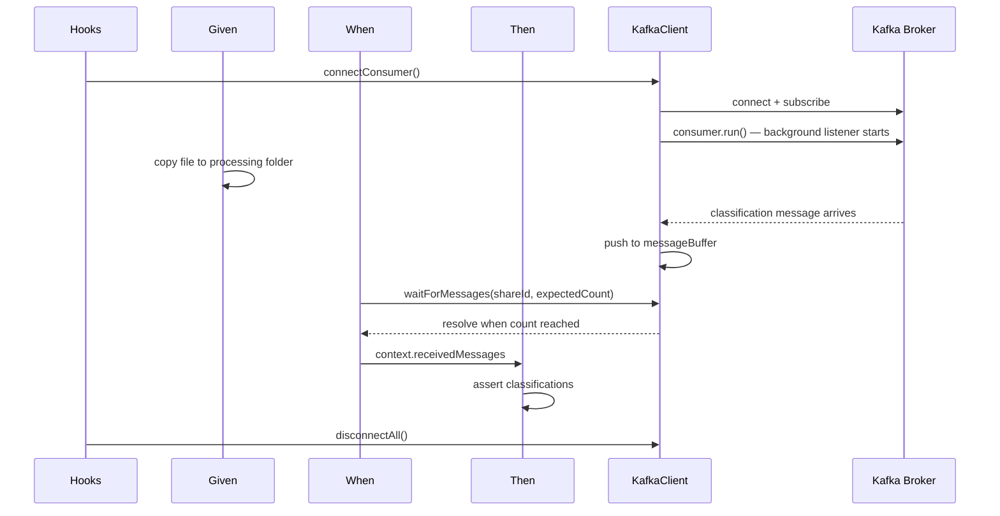
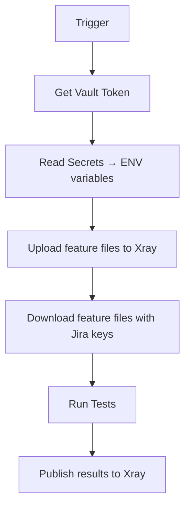

# arc42 Architecture Documentation
# IDEP — Kafka Integration Test Framework

---

## 1. Introduction and Goals

Validates that when a document is uploaded, it is correctly classified.

---

## 2. Constraints

### 2.1 Technical Constraints

| Constraint | Reason |
|---|---|
| TypeScript / Node.js | Platform standard |
| Cucumber-JS 11.x | BDD framework — platform standard |
| KafkaJS | Standard JS/TS Kafka client |
| GitLab CI/CD | Standard pipeline platform |
| Xray / Jira | Test management and reporting — platform standard |

### 2.2 Organisational Constraints

- Framework is owned by the [Team] team
- Built on the [Platform] standard — browser-coupled components deliberately excluded (see AD-08, AD-13)
- Xray integration is pipeline-only — not used in local development runs
- MR pipeline runs lint and syntax checks only — no test execution (see AD-14)
- Regression runs on a shared GitLab runner — resource contention is a known risk

---

## 3. System Scope and Context



The test framework owns two interactions only:
- **OUT** — file copy to trigger processing
- **IN** — Kafka Topic consumption and assertion

Everything in between is a black box.

---

## 4. Solution Strategy

### 4.1 Key Design Decisions

| Decision | Choice | Rationale |
|---|---|---|
| Test trigger | SSH file copy to processing folder | Tests real pipeline — bypassing would give false confidence |
| Message consumption | `fromBeginning: false` | Prevents stale messages from previous runs |
| Completion detection | Expected count + timeout | No completion signal in payload — count derived from test data |
| Correlation | `shareId` field | Groups all messages belonging to one document package |
| Classification mapping | `document-classification-mapping.json` in `lib/` | Change controlled contract — not throwaway test data |
| Consumer group ID | `groupId-${Date.now()}` | Fresh consumer per run — no stale offset history |
| Execution model | Sequential | Predictable, traceable, auditable |

### 4.2 Test Strategy

| Type | Scope | Trigger | Data Source |
|---|---|---|---|
| Smoke | 2 scenarios — single and multiple classifications | Manual or pipeline | Hardcoded in feature file |
| Regression | ~60 document cases | Nightly schedule or release tag | `regression-cases.json` |

---

## 5. Building Block View



| Component | Responsibility |
|---|---|
| Steps | Cucumber step definitions — orchestrates Given/When/Then |
| KafkaClient | Kafka connection, subscription, message buffer |
| Helpers | Test logic — waitForMessages, resolveDocumentClassIds, publishStubMessage |
| Config | Environment variables — single source, nothing hardcoded elsewhere |
| Types | Data contracts — ClassificationEvent, ScenarioState, RegressionCase |
| Kafka Broker | External — managed Kafka broker |

---

## 6. Runtime View



> **Note:** In local development, file copy is done manually while the consumer waits. In the pipeline, file copy is automated in the Given step. The framework flow is identical in both cases.

---

## 7. Pipeline View

### 7.1 MR Pipeline

Runs on every merge request. Fast, no infrastructure dependency.

```
lint → syntax check
```

No test execution on MR — requires Kafka access and processing folder which are not available in MR context.

### 7.2 Scheduled Pipeline



**Why upload then download?**
Upload assigns Jira test case keys to feature files. Download retrieves the feature files with those keys embedded. Without this step, results cannot be linked to existing Jira test cases — new test cases would be created on every run.

---

## 8. Cross-Cutting Concepts

### 8.1 Timeout Strategy

| Level | Config | Purpose |
|---|---|---|
| Kafka timeout | `MAX_WAIT_FOR_MESSAGE_MS` (default 30s) | How long to wait for classification messages |
| Cucumber timeout | `setDefaultTimeout` (30 mins) | Safety net — must always be larger than Kafka timeout |
| Per scenario | `within {int} seconds` step | Optional override for known slow documents |
| GitLab job timeout | `.gitlab-ci.yml` | Absolute ceiling above everything |

**Rule:** Kafka timeout always fires before Cucumber timeout. Cucumber timeout is a last resort — it should never fire in normal operation.

### 8.2 Sequential Execution

Tests run sequentially — one scenario at a time. Deliberate decision:

- Predictable — failures are isolated and traceable
- Auditable — clear order of execution in reports
- Safe — no message buffer race conditions between scenarios

---

## 9. Architecture Decisions

| ID | Decision | Status | Rationale |
|---|---|---|---|
| AD-01 | SSH file copy over direct Kafka publish | Decided | Tests real pipeline — bypassing would give false confidence |
| AD-02 | `fromBeginning: false` on Kafka consumer | Decided | Prevents consuming stale messages from previous runs |
| AD-03 | Expected count + timeout for completion detection | Decided | No completion signal in payload — count derived from test data |
| AD-05 | JSON for regression, inline for smoke | Decided | 60+ rows in Scenario Outline is unreadable — JSON keeps feature files clean |
| AD-06 | Human-readable filenames | Identified | UUID filenames make debugging harder — not yet raised with team |
| AD-08 | Core submodule excluded | Decided | Core is browser-coupled — no UI layer in IDEP |
| AD-09 | `document-classification-mapping.json` in `lib/` | Decided | Classification IDs are a system contract — change controlled via MR |
| AD-10 | `Date.now()` group ID per run | Decided | Fresh consumer group per run — no stale offset history |
| AD-11 | Sequential test execution | Decided | Predictable, traceable, auditable |
| AD-12 | `BROWSER=test_execution` in pipeline | Decided | Xray library requires BROWSER variable — neutral value resolves correct execution config file |
| AD-13 | Pipeline defined in IDEP repo | Decided | Framework pipeline is browser-coupled — IDEP needs full control |

---

## 10. Risks

| Risk | Impact | Mitigation |
|---|---|---|
| Processing system polling interval unknown | Timeout is a guess — could cause flaky tests | Confirm interval with team — tune `MAX_WAIT_FOR_MESSAGE_MS` |
| No completion signal in payload | Count-based detection could fail if unexpected message count | Confirm if total document count can be added to Kafka message |
| GitLab runner resource contention during regression | May block other projects on shared runner | Schedule regression during off-peak hours |
| UUID filenames difficult to trace | Failures hard to link back to specific documents | Pending team confirmation — AD-06 |
